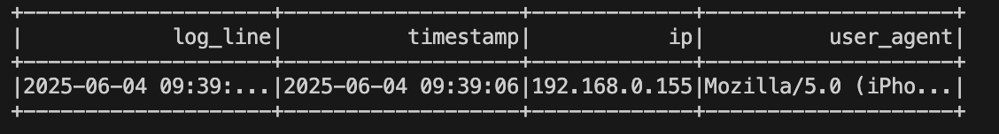

# Mini Lambda Architecture – Spark, Kafka & Iceberg

Ce projet simule une architecture Lambda locale pour traiter des logs de connexion en temps réel et en batch avec Apache Spark, Spark Streaming et Kafka.

## Structure du projet

- **src/log_producer.py** : Génère des logs simulés et les envoie dans un topic Kafka.
- **src/kafka_to_logs.py** : (Question 2) Application Spark Streaming qui lit les logs du topic Kafka et les écrit sur le file system local (`output/logs/`).
- **src/spark_streaming.py** : Calcule des métriques en temps réel à partir des logs (speed layer).
- **src/spark_batch.py** : Calcule les mêmes métriques en batch à partir des fichiers locaux (batch layer).
- **src/merge_files.py** : Fusionne les petits fichiers générés par le streaming.
- **src/icebergapp.py** : (Question 5) Utilise Apache Iceberg pour gérer les petits fichiers et les updates.

## Prérequis

- Java
- Python 3.x
- Apache Spark (avec PySpark)
- Kafka (Docker recommandé)

## Utilisation

### 1. Générer des logs simulés dans Kafka

```bash
python3 src/log_producer.py
```

### 2. Consommer les logs Kafka et les écrire sur le file system (Question 2)

```bash
python3 src/kafka_to_logs.py
```
Les logs seront écrits dans `output/logs/`.

### 3. Calculer les métriques en streaming (speed layer)

```bash
python3 src/spark_streaming.py
```

### 4. Calculer les métriques en batch (batch layer)

```bash
python3 src/spark_batch.py
```

### 5. Fusionner les petits fichiers

```bash
python3 src/merge_files.py
```

### 6. Utiliser Iceberg pour la gestion avancée (Question 5)

```bash
PYSPARK_SUBMIT_ARGS="--packages org.apache.iceberg:iceberg-spark-runtime-3.5_2.12:1.5.0 pyspark-shell" python3 src/icebergapp.py
```
Les données seront stockées dans `output/iceberg/warehouse/logs_iceberg`.

Exemple de résultat lors de la lecture de la table Iceberg :



---

**Ce projet illustre la Lambda Architecture avec des outils big data modernes, en local.**